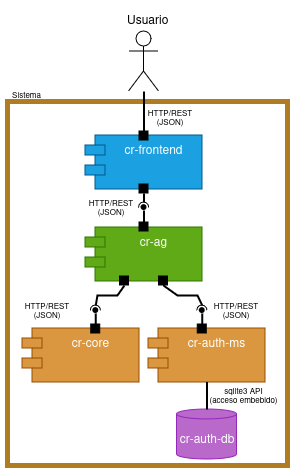

# CocoCash Retro

CocoCash Retro es un sistema de software que simula una billetera digital inspirada en el estilo ochentero de software para mainframes. La arquitectura es de microservicios en contenedores y orquestados con Docker Compose:
- **cr-frontend**: frontend moderno (Next.js).
- **cr-ag**: API Gateway (NestJS).
- **cr-core**: core en COBOL, organizado en módulos y rutinas.
- **cr-auth-ms**: microservicio de autenticación (FastAPI); gestiona registro, inicio de sesión y emisión de tokens JWT.
- **cr-auth-db**: base de datos SQLite ligera con usuarios registrados y la asociación de cada usuario con su `wallet_id` (no almacena saldo ni movimientos).

## Tecnologías usadas
* **Ubuntu**: Entorno principal de desarrollo y ejecución del sistema.
* **Docker**: Contenerización de los servicios del sistema.
* **Docker Compose**: Orquestación de los microservicios (frontend, API Gateway, core y autenticación).
* **GnuCOBOL**: Implementación del core transaccional; programas organizados en `src/cobol/`, compilados con `make` y ejecutados como binarios dentro del microservicio core.
* **libcob5**: Runtime necesario para la ejecución de binarios COBOL generados con GnuCOBOL.
* **Node.js 22**: Runtime utilizado en todos los servicios Node.js (frontend, API Gateway y servidor HTTP del core).
* **Next.js 16**: Frontend web del sistema, ejecutado en `localhost:3000`, consume REST del API Gateway.
* **NestJS**: API Gateway en `localhost:3001`; expone endpoints REST y orquesta la comunicación con el core y el microservicio de autenticación.
* **Python 3.11 + FastAPI**: Microservicio de autenticación (`cr-auth-ms`), expuesto en `localhost:4000`; valida credenciales, registra usuarios y emite JWT con `wallet_id`.
* **SQLite**: Base de datos embebida en `cr-auth-db`; persiste usuarios (`email`, `name`, `password_hash`) y el `wallet_id` asociado a cada cuenta. El archivo de datos vive en `cr-auth-db/data/auth.db`.
* **passlib + bcrypt**: Hash seguro de contraseñas en el microservicio de autenticación.
* **python-jose (JWT)**: Generación y validación de tokens de sesión incluyendo `email`, `name` y `wallet_id`.
* **HTTP (REST interno)**: Mecanismo de comunicación entre API Gateway y core (`http://core:3002`), y entre API Gateway y autenticación (`http://auth-ms:4000`).
* **TypeScript**: Lenguaje base del frontend y del API Gateway.
* **npm**: Gestor de dependencias para los servicios Node.js.
* **pip**: Gestor de dependencias para el microservicio de autenticación.
* **child_process.spawn (Node.js)**: Utilizado exclusivamente dentro del microservicio core para ejecutar los binarios COBOL.
* **localStorage (navegador)**: Persistencia mock de saldo, movimientos y cuenta bancaria, indexada por `wallet_id` del usuario autenticado (`mock_wallet_data_{wallet_id}`).

## Cómo ejecutar
1. Levantar todo el entorno (build + ejecución de contenedores):

```
make
```

2. Ver logs en tiempo real (opcional pero recomendado la primera vez):

```
make logs
```

3. Abrir el navegador y acceder al frontend:

```
http://localhost:3000
```


## Comunicación entre frontend y core
Para lograr que el **frontend mostrara y enviara información al core en COBOL**, se utilizó una arquitectura de microservicios desacoplada, dockerizada y orquestada con **Docker Compose**.

En el contenedor `cr-core`, los programas COBOL se organizan en `src/cobol/` y se compilan automáticamente mediante **GnuCOBOL** y `make`, generando binarios en `/app/bin`. Se implementó además un servidor HTTP en Node.js que expone endpoints como `/run/:program` y `/programs`. Este servidor ejecuta los binarios COBOL usando `child_process.spawn`, captura su salida estándar (stdout/stderr) y la devuelve como respuesta HTTP. También se instalaron dependencias de runtime como `libcob5`, necesarias para ejecutar los binarios.

El flujo interno del core es:
HTTP request → spawn → binario COBOL → stdout → HTTP response

En el **API Gateway (NestJS)**, el servicio `CobolService` actúa como cliente HTTP del core, delegando completamente la ejecución de programas. Este componente permite invocar programas COBOL de forma dinámica, incluyendo el envío de parámetros mediante query strings.

En el **frontend (Next.js)**, se implementó una interfaz interactiva que permite al usuario ingresar texto y enviarlo al API Gateway. El frontend consume el endpoint `/cobol/:program`, pasando parámetros como `?msg=...`. La respuesta del core se muestra directamente en la interfaz.

El flujo completo del sistema es:
Usuario → Frontend → API Gateway → Core → Programa COBOL → stdout → respuesta al usuario.

De esta forma, se logró integrar un sistema COBOL dentro de una arquitectura web moderna, permitiendo mostrar resultados y procesar entrada dinámica del usuario.

## Vista C&C


## Proyectos relacionados
* **CocoCash**: Plataforma de gestión financiera nativa de la nube.
Repositorio disponible en: https://github.com/cococash-swarchqua/cococash/


